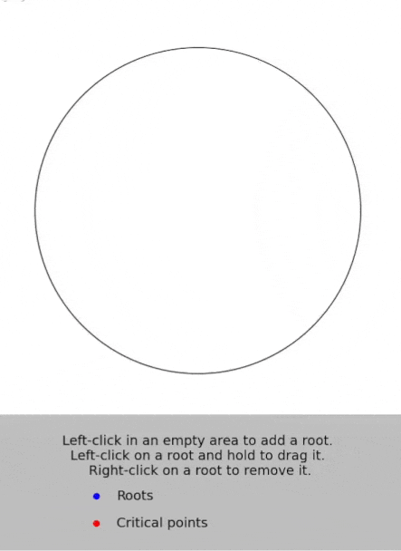

# Polynomial-roots-and-critical-points
This is a simple interactive Python tool that allows users to create, remove, and move roots of a polynomial and watch how the polynomial's critical points evolve. It was inspired by Sendov's conjecture and [this analogous tool in Mathematica](https://www.wolframcloud.com/objects/demonstrations/SendovsConjecture-source.nb).

### Controls
- Adding roots: Left-click in an empty area to add a root.
- Moving roots: Left-click on a root and hold the left click button to drag it as you move your mouse.
- Removing roots: Right-click on a root to remove it.

### Preview
